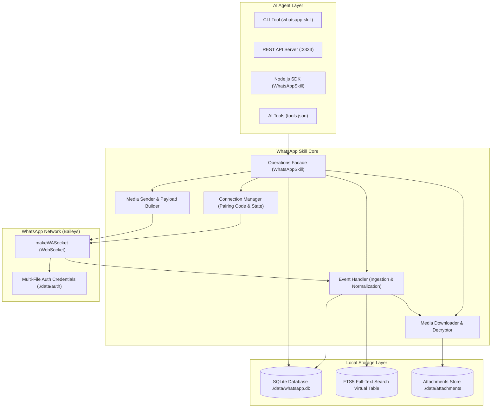

# WhatsApp Web Skill for AI Agents

[](https://opensource.org/licenses/MIT)
[](https://nodejs.org)
[](https://github.com/WhiskeySockets/Baileys)

A reusable, production-grade **WhatsApp Web skill for AI Agents** built on top of [WhiskeySockets/Baileys](https://github.com/WhiskeySockets/Baileys).

The skill provides **WhatsApp pairing code authentication** (no QR codes required), local high-speed message indexing via **SQLite & FTS5 full-text search**, complete **attachment and media management** (images, videos, audio, voice notes, PDFs, spreadsheets, and documents), and clean interfaces for AI Agents via CLI, REST API, or programmatic tool calls.

---

## Architecture Overview



---

## Key Features

1. **WhatsApp Pairing Code Authentication (No QR Codes)**:
   - Authenticate completely headless by requesting an 8-character pairing code using the user's phone number.
   - Enter the code on the mobile device via *Settings > Linked Devices > Link with phone number instead*.
   - Automatically detects authentication and securely persists session credentials.
   - Restores session automatically across restarts.

2. **Local Searchable Message Index (SQLite + FTS5)**:
   - Incoming and outgoing messages are stored in a local SQLite database with Write-Ahead Logging (WAL).
   - FTS5 virtual tables and automatic database triggers enable instant keyword search across message bodies, image/video captions, and document filenames.
   - Rich filtering: sender, sender name, phone number, recipient, chat, group/private, date range, message type, read status, and media attachments.

3. **Complete Attachment & Media Support**:
   - First-class support for **Images, Videos, Audio, Voice notes (PTT), Documents (PDFs, spreadsheets, presentations, text files), Stickers, Contacts, and Locations**.
   - Decrypts and downloads attachments using Baileys decryptor and caches locally to avoid redundant re-downloads.
   - SHA-256 checksum verification and file size tracking.
   - Natural sending and replying with attachments.

4. **Agent-Friendly Operations & Tools**:
   - 16 standardized operations exposed as CLI commands, REST HTTP API endpoints, and OpenAI/Gemini/Anthropic tool schemas ([`tools.json`](file:///home/lojik/Documents/GitHub/whatsapp-skill/tools.json)).

---

## Installation & Setup

### Prerequisites
- Node.js >= 20.0.0
- npm or pnpm

### Setup
```bash
git clone https://github.com/WhiskeySockets/Baileys # or this repository
cd whatsapp-skill

# Install dependencies
npm install

# Setup environment configuration
cp .env.example .env
```

---

## Connecting WhatsApp via Pairing Code

1. Request a pairing code:
   ```bash
   npx tsx bin/whatsapp-skill.js connect "+15551234567"
   ```
2. The terminal will display:
   ```text
   ========================================
   PAIRING CODE: ABCD-1234
   ========================================
   1. Open WhatsApp on your phone.
   2. Tap Settings (iOS) or Menu (Android) > Linked Devices.
   3. Tap "Link a Device".
   4. Select "Link with phone number instead" at the bottom of the screen.
   5. Enter the pairing code: ABCD-1234.
   ```
3. Enter the code in your WhatsApp app. Once entered, the skill detects the connection and transitions to `Connected`.

---

## CLI Usage

The skill provides an executable CLI (`bin/whatsapp-skill.js` or `npm run cli`):

```bash
# Check status
npx tsx bin/whatsapp-skill.js status

# List recent conversations
npx tsx bin/whatsapp-skill.js chats --limit 20

# Search conversations
npx tsx bin/whatsapp-skill.js search-chats "School"

# Search messages with FTS5 keyword
npx tsx bin/whatsapp-skill.js search --query "invoice"

# Search messages from specific sender within date range
npx tsx bin/whatsapp-skill.js search --sender-name "John" --since "2026-09-01" --until "2026-09-15"

# Show messages with documents received this month
npx tsx bin/whatsapp-skill.js search --has-attachment --attachment-type "document" --since "this month"

# Send a text message
npx tsx bin/whatsapp-skill.js send --to "+15551234567" --text "Hello from AI Agent!"

# Reply to a message
npx tsx bin/whatsapp-skill.js reply --message-id "3EB012345" --text "I have processed your request."

# Send an attachment (PDF, image, etc.)
npx tsx bin/whatsapp-skill.js send-attachment --to "+15551234567" --file "./docs/agenda.pdf" --caption "Meeting Agenda"

# Reply with an attachment
npx tsx bin/whatsapp-skill.js reply-attachment --message-id "3EB012345" --file "./chart.png" --caption "Here is the chart"

# Download an attachment
npx tsx bin/whatsapp-skill.js download "3EB012345"
```

---

## REST API Server

Run the HTTP server:
```bash
npm run serve
# Server listening on http://127.0.0.1:3333
```

 > [!WARNING]
 > **One active socket per device.** WhatsApp allows only a single live connection per device session. While the `serve` daemon (or a `connect` receiver) is running, one-shot CLI commands that open their own socket (`send`, `chats`, `search`, …) will fail with `Connection Closed` / `Precondition Required`.
 > Pick **one** socket owner: either run the `serve` daemon and route sends/queries through its HTTP endpoints (e.g. `POST /messages/send`), **or** use one-shot CLI commands with no persistent daemon running.

### Endpoints

| Method | Route | Description |
|---|---|---|
| `GET` | `/status` | Connection state & authenticated user info |
| `POST` | `/connect` | Request pairing code (`{"phoneNumber": "..."}`) |
| `GET` | `/pairing-code` | Get active pairing code |
| `POST` | `/disconnect` | Disconnect WhatsApp |
| `GET` | `/chats` | Get chats (`?limit=50&offset=0&isGroup=true`) |
| `GET` | `/chats/search` | Search chats (`?query=...`) |
| `GET` | `/contacts` | Get contacts (`?limit=50&offset=0`) |
| `GET` | `/messages` | Read messages (`?chatId=...&limit=20`) |
| `POST` | `/messages/search` | Multi-filter message search |
| `GET` | `/messages/:id` | Get message by ID |
| `POST` | `/messages/send` | Send text message (`{"to":"...", "text":"..."}`) |
| `POST` | `/messages/reply` | Reply to message (`{"messageId":"...", "text":"..."}`) |
| `POST` | `/messages/send-attachment` | Send attachment (`{"to":"...", "file":"...", "caption":"..."}`) |
| `POST` | `/messages/reply-attachment` | Reply with attachment (`{"messageId":"...", "file":"..."}`) |
| `GET` | `/messages/:id/download` | Download attachment (`?raw=true` to stream binary) |

---

## Programmatic AI Agent SDK

```typescript
import { WhatsAppSkill } from 'whatsapp-skill';

const skill = new WhatsAppSkill();

// Real-time message listener
skill.onMessage(async (msg) => {
  console.log(`Received ${msg.messageType} from ${msg.senderName}: ${msg.text}`);

  if (msg.text.toLowerCase().includes('help')) {
    await skill.replyToMessage(msg.messageId, 'How can I assist you today?');
  }
});

// Powerful search
const results = await skill.searchMessages({
  query: 'contract',
  hasAttachment: true,
  since: 'this month',
});
```

---

## Configuration (`.env`)

| Variable | Default | Description |
|---|---|---|
| `WHATSAPP_AUTH_DIR` | `./data/auth` | Location for Baileys auth credentials (`0700` permission) |
| `WHATSAPP_DB_PATH` | `./data/whatsapp.db` | SQLite database file location |
| `WHATSAPP_ATTACHMENTS_DIR` | `./data/attachments` | Local directory for saved attachments |
| `AUTO_DOWNLOAD_MEDIA` | `true` | Automatically download incoming media |
| `MAX_AUTO_DOWNLOAD_SIZE_MB` | `50` | Maximum file size (MB) for automatic download |
| `PORT` | `3333` | HTTP daemon port |
| `HOST` | `127.0.0.1` | HTTP daemon host |
| `WHATSAPP_API_KEY` | `""` | Optional API key for HTTP header `x-api-key` |
| `LOG_LEVEL` | `info` | Logging verbosity (`debug`, `info`, `warn`, `error`, `silent`) |

---

## Running Tests

Execute the comprehensive automated test suite:
```bash
npm test
```
The suite verifies pairing code generation, session state transitions, database migrations, FTS5 searching, multi-filter combinations, attachment encryption/decryption, sending and replying.
